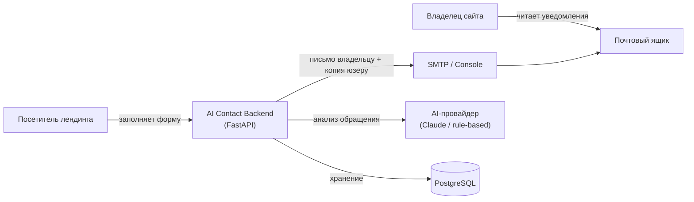
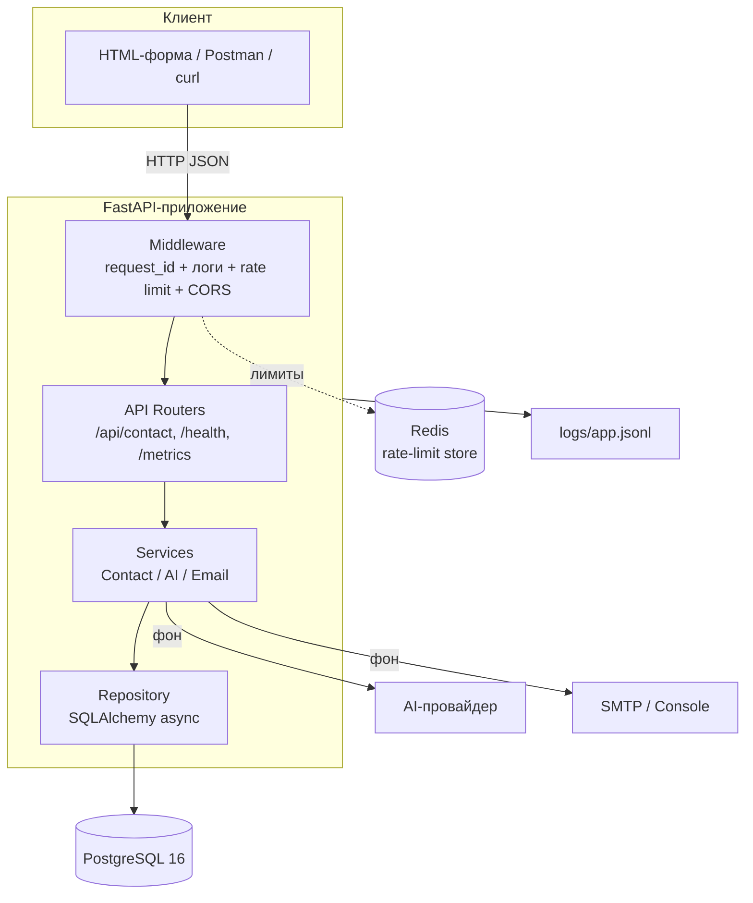
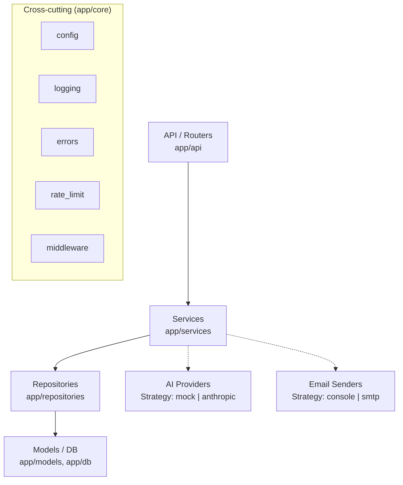
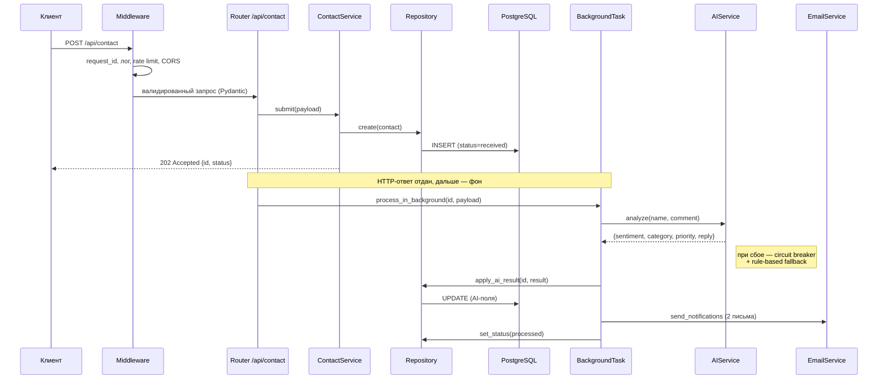

# Архитектура

Документ описывает архитектуру сервиса обратной связи: компоненты, слои,
потоки данных. Диаграммы — в нотации [C4](https://c4model.com/) на Mermaid
(рендерятся прямо на GitHub).

## 1. Контекст (C4 Level 1)

Сервис принимает обращения с формы обратной связи, анализирует их AI-инструментом
(тональность, категория, приоритет, черновик ответа), сохраняет в БД и рассылает
два письма: уведомление владельцу и подтверждение отправителю.

## 2. Контейнеры (C4 Level 2)

## 3. Компоненты и слои (C4 Level 3)

Приложение построено по **слоистой архитектуре** — зависимость строго сверху вниз,
каждый слой знает только о нижнем:

| Слой | Каталог | Ответственность |
|------|---------|-----------------|
| **API / Routers** | `app/api` | HTTP-контракт, коды ответов, DI. Без бизнес-логики. |
| **Services** | `app/services` | Бизнес-логика, оркестрация, AI и email как стратегии. |
| **Repositories** | `app/repositories` | Доступ к данным, инкапсуляция SQLAlchemy. |
| **Models / DB** | `app/models`, `app/db` | ORM-модели, сессии, миграции. |
| **Core** | `app/core` | Сквозная функциональность: конфиг, логи, ошибки, лимиты. |

## 4. Поток обработки обращения (полный цикл)

**Ключевое решение:** тяжёлые операции (AI, SMTP) вынесены в фоновую задачу,
поэтому клиент получает ответ `202 Accepted` за десятки миллисекунд, не дожидаясь
внешних сервисов. Подробнее — [ADR-0004](adr/0004-background-tasks.md).

## 5. Надёжность

- **Graceful fallback AI** — [ADR-0003](adr/0003-ai-provider-abstraction.md):
  circuit breaker + rule-based провайдер. Обращение обрабатывается всегда.
- **Независимая отправка писем** — сбой одного письма не отменяет второе.
- **Идемпотентные миграции** — `alembic upgrade head` на каждом старте контейнера.
- **Health с проверкой зависимостей** — `/api/health` пингует БД.

## 6. Модель данных

Единственная таблица `contacts` (см. `app/models/contact.py`):

| Группа | Поля |
|--------|------|
| Данные формы | `name`, `email`, `phone` (E.164), `comment` |
| AI-результат | `sentiment`, `category`, `priority`, `suggested_reply`, `ai_provider` |
| Служебное | `status`, `client_ip`, `request_id`, `created_at` |

Enum'ы хранятся как VARCHAR (`native_enum=False`) — переносимо между Postgres и
SQLite и не требует `ALTER TYPE` при добавлении категорий.
