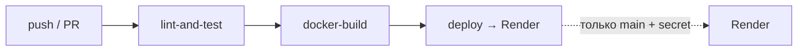

# CI/CD

Пайплайн описан в `.github/workflows/ci.yml`. Философия: **каждый push и PR
проходят lint + тесты + сборку образа; деплой — только с `main`**.

## Схема



## Джоба 1 — lint-and-test

Запускается на каждый push и PR. Поднимает сервисный контейнер **PostgreSQL 16**.

Шаги:
1. `actions/setup-python@v5` — Python 3.12.
2. Установка Poetry + кеш зависимостей по `poetry.lock`.
3. `poetry install` — воспроизводимая установка из lock-файла.
4. **`ruff check`** — линтер (стиль, импорты, баги).
5. **`alembic upgrade head`** — проверяем, что миграции применяются к настоящему
   Postgres (а не только к SQLite в тестах).
6. **`pytest --cov`** — тесты с покрытием (гоняются на SQLite: быстро, изолированно).

## Джоба 2 — docker-build

Зависит от `lint-and-test`. Собирает Docker-образ через Buildx с GHA-кешем слоёв
(`cache-from/to: type=gha`). Push в реестр не делается — проверяем только
собираемость (для тестового достаточно; в проде добавился бы push в registry).

## Джоба 3 — deploy (Render)

Условие: `github.ref == 'refs/heads/main'` и событие `push`. Дёргает **Render
Deploy Hook** из секрета `RENDER_DEPLOY_HOOK`. Если секрет не задан — джоба
пропускается без ошибки (удобно для форков и первого прогона).

### Настройка секрета

1. Render Dashboard → сервис → Settings → **Deploy Hook** → скопировать URL.
2. GitHub → репозиторий → Settings → Secrets and variables → Actions →
   **New repository secret** → имя `RENDER_DEPLOY_HOOK`, значение — URL хука.

## Деплой на Render (Blueprint)

Файл `render.yaml` описывает инфраструктуру как код: web-сервис (Docker) +
managed PostgreSQL.

1. Render Dashboard → **New → Blueprint** → выбрать репозиторий.
2. Render создаёт БД `contacts-db` и сервис `ai-contact-backend`.
3. Переменные с `sync: false` (`EMAIL_OWNER`, `ANTHROPIC_API_KEY`, ...) вводятся в
   дашборде вручную (не хранятся в репозитории).
4. `healthCheckPath: /api/health` — Render считает сервис живым по нему.

> **Грабля DATABASE_URL.** Render/managed-Postgres отдаёт URL в формате
> `postgres://...`, а async SQLAlchemy требует `postgresql+asyncpg://...`.
> Приложение **нормализует URL автоматически** (`app/core/config.py`,
> `_normalize_db_url`), поэтому `fromDatabase.connectionString` работает без
> ручной правки.

## Локальный эквивалент CI

Перед пушем можно прогнать те же проверки локально:

```bash
poetry run ruff check app tests
poetry run pytest --cov=app
docker compose build
```
